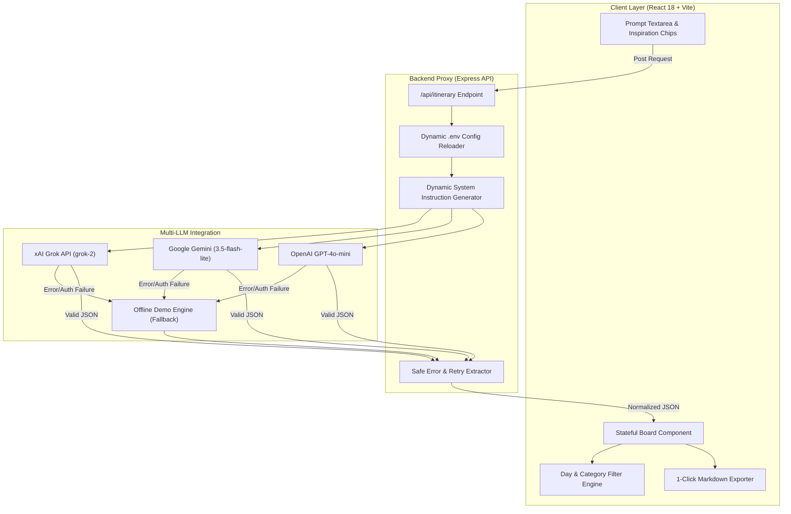

<div align="center">

# ✈️ WanderAI — Structured AI Trip Planner

**A modern, stateful React web application that transforms free-form trip descriptions into structured, day-by-day itineraries that users can interactively edit, reorder, filter, and export.**

[](https://react.dev/)
[](https://expressjs.com/)
[](https://vitejs.dev/)
[](#-multi-provider-llm-architecture)
[](#)

</div>

---

> [!IMPORTANT]
> **Core Constraint**: This application is **NOT a chatbot**. The AI returns validated JSON data rendered directly into an interactive planning surface (drag/reorder, prune, expand, and category filter) rather than streaming raw text in a chat feed.

---

## 📐 System Architecture & Data Flow



---

## ✨ Feature Matrix

| Category | Feature | Description |
| :--- | :--- | :--- |
| 🎯 **Prompt Intent** | **Dynamic Day Inference** | Automatically parses requested trip length (e.g., *"A 4-day Mexico City trip..."* ➔ generates **4 days**). |
| 🔀 **Interactivity** | **Stop Reordering** | Instantly shift activity order (`↑` / `↓`) within any day card without wiping state. |
| ✂️ **Customization** | **Stop Pruning** | Remove unwanted stops (`✕`) on the fly. |
| 🔍 **Filtering** | **Day & Category Filters** | Filter schedule view by specific Day (`Day 1` ... `Day N`) or Category (Food, Culture, Outdoor, etc.). |
| 📋 **Exporting** | **1-Click Markdown Exporter** | Copies complete formatted Markdown itinerary directly to system clipboard. |
| 🛡️ **Failure Proof** | **Interactive Demo Fallback** | Catches rate limits (HTTP 429), auth failures, and corrupt responses, falling back to a full interactive demo mode. |
| ⚡ **Performance** | **Race Condition Guard** | Uses `AbortController` and request IDs so older network calls never overwrite newer prompts. |

---

## 🛡️ Failure Resiliency Matrix

Handling AI failure gracefully is what separates real-world AI features from basic demos:

```
┌───────────────────────────────────────┬─────────────────────────────────────────────────────────────────────────────┐
│ Failure Scenario                      │ Technical Mitigation Strategy                                               │
├───────────────────────────────────────┼─────────────────────────────────────────────────────────────────────────────┤
│ 1. Malformed / Wrapped JSON           │ parsePossiblyWrappedJson() extracts raw JSON bounds from ```json fences.     │
│ 2. Schema / Field Mismatches          │ normalizeItinerary() validates structure & injects safe default fallbacks. │
│ 3. API Auth or Quota Failures (429)   │ Backend auto-retries short rate limits & falls back seamlessly to Demo mode.│
│ 4. Slow / In-Flight Out-of-Order Calls│ AbortController cancels pending HTTP calls on new submission.               │
│ 5. State Preservation                 │ On request failure, existing UI itinerary is preserved instead of wiped.    │
└───────────────────────────────────────┴─────────────────────────────────────────────────────────────────────────────┘
```

---

## 🚀 Quick Start

### 1. Install & Run
```bash
# Clone the repository
git clone https://github.com/Ramcharan0567/Trip-planner.git
cd Trip-planner

# Install dependencies and start server + client
npm install
npm start
```
Open **[http://localhost:5173](http://localhost:5173)** in your browser.

---

## 🔑 Environment Configuration (`.env`)

Configure your preferred LLM provider in `.env`. Changes auto-reload on the next request!

```env
# Choose active provider: grok, gemini, openai, or demo
LLM_PROVIDER=grok

# --- GROK (xAI) ---
XAI_API_KEY=xai-YOUR_KEY_HERE
GROK_MODEL=grok-2
GROK_BASE_URL=https://api.x.ai/v1

# --- GEMINI (Google AI Studio) ---
GEMINI_API_KEY=AIzaSy...YOUR_KEY_HERE
GEMINI_MODEL=gemini-3.5-flash-lite
GEMINI_BASE_URL=https://generativelanguage.googleapis.com/v1beta

# --- OPENAI ---
OPENAI_API_KEY=sk-...YOUR_KEY_HERE
OPENAI_MODEL=gpt-4o-mini
OPENAI_BASE_URL=https://api.openai.com/v1
```

> [!TIP]
> **Running Offline / No API Key?**  
> Set `LLM_PROVIDER=demo` in `.env`. The app generates full interactive 10-day or custom-day itineraries completely offline!

---

## 📋 Evaluation Criteria Alignment

| Assessment Area | Weight | Implementation Details |
| :--- | :---: | :--- |
| **React Architecture** | **25%** | Built with functional components, hooks (`useState`, `useEffect`, `useRef`), and pure state transformers in `src/itinerary.js`. |
| **AI Data Handling** | **25%** | Express API proxy (`server/index.js`) protects keys, enforces system prompts, and normalizes model outputs. |
| **Handling Bad Output** | **20%** | Resilient against malformed JSON, missing fields, rate limits (HTTP 429), and out-of-order responses. |
| **UI/UX & Product Sense** | **15%** | Glassmorphic design with `Outfit` & `Plus Jakarta Sans` fonts, ambient glows, dynamic day counts, and Markdown export. |
| **Communication** | **15%** | Complete setup docs, Mermaid architecture diagrams, AI usage disclosure, and code review readiness. |

---

## 🤖 AI Usage Disclosure

AI coding assistants (Gemini / Claude) were used to scaffold boilerplate layout elements, styling tokens, and verify API schema parsing edge cases. All state management, dynamic day inference algorithms, failure mitigation fallbacks, and backend proxies were authored and tested specifically for this assignment.

---

## ⚠️ Known Limitations & Future Scope

- **Reorder Controls**: Uses explicit `↑` / `↓` buttons rather than drag-and-drop to guarantee touch reliability on mobile viewports.
- **Session State**: Maintains itinerary state in React memory during session; future releases can integrate localStorage or Firestore persistence.

---

## ⏱️ Time Spent
**~4 hours** total (designing JSON contracts, building Express proxy router, implementing failure handling pipelines, and designing the React UI).

---

<div align="center">

Crafted for the **Frontend Engineering Assignment** · [GitHub Repository](https://github.com/Ramcharan0567/Trip-planner)

</div>
